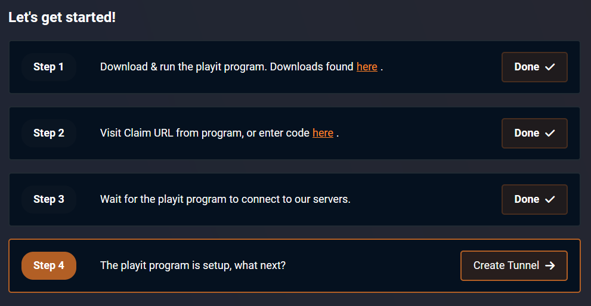

# Playit.gg

Nesse tutorial, você aprenderá a utilizar o playit,gg para deixar o seu servidor de MInecraft hospedado em seu computador acessível publicamente pela internet, para isso, siga os passos abaixo:

### 1. Entre no site e crie sua conta

Acesse o [site do playit.gg](https://playit.gg/) e crie a sua conta, precisará clicar em "Login" no canto superior direito, e depois disso "Create an Account", coloque as informações requisitadas e continue para o proximo passo.

### 2. Instale o playit.gg

Playit fornece um setup simples de seguir, então, siga os passos que aparecer:

1. Baixe o programa do playit no link providenciado, precisará escolher o seu sistema operacional
2. Após baixar, inicie o programa apertando duas vezes no arquivo baixado e siga os passos de instalação.
3. Quando terminar a instalação, aperte em "Yes, It's running"

### 3. Inicie o programa

1. Aperte o botão do windows, ou procure pelo programa "playit.gg" e clique nele
2. Abrirá um cmd com um link para acessar, abra ele no navegador em que você está logado
3. O servidor do playit se conectará ao seu computador, apenas aceite o agent clicando em "Continue"
4. Dê um nome indicativo para ele, ou apenas bata a cabeça no teclado.
5. Agora espere alguns segundos para o playit se iniciar

Até este passo, você deverá estar nesta tela:

<figure><figcaption></figcaption></figure>

### 4. Crie o túnel

1. Clique em Create Tunnel
2. Deixe selecionado a região como "Global Anycast" e o Tunnel Type como "Minecraft Java"
   1. Caso o seu servidor aceite jogadores Java e Bedrock, ou não seja de Minecraft Java, selecione o Tunnel Type como TCP + UDP
3. Após criar o seu tunel "Minecraft Java", inicie o seu servidor na porta 25565, não precisará alterar o IP do servidor no server.properties
   1. Caso tenha escolhido TCP + UDP e mais de uma porta, ela estará em sequência, por exemplo, a porta 25565 e a quantidade de portas em 3, liberará as portas 25565, 25566 e 25567

Assim, você deverá estar nesta tela:

<figure><figcaption></figcaption></figure>

Encontrará o domínio para entrar no seu servidor, assim como o IP numérico para ele, apenas dê esse domínio ou IP para o seus amigos e pronto!

Ex: No meu caso o meu domínio é `functions-promo.gl.joinmc.link` e o IP numérico `147.185.221.21:40637`

Poderá conferir se o seu servidor está acessível publicamente utilizando o [mcsrvstatus](https://mcsrvstat.us/), apenas coloque o IP do seu servidor que verá se ele está acessível, ou teste enviando para os seus amigos ou você mesmo entrando!

#### Observações finais

1. Após seguir os passos de instalação uma vez, precisará apenas iniciar o programa novamente quando quiser deixar o seu servidor público
2. Caso tenha um servidor em que permite e entrada de piratas, utilize algum plugin de login como [nLogin ](https://www.nickuc.com)para garantir uma proteção e segurança básica.
3. Você precisará deixar o seu computador, servidor e playit rodando para continuar deixando ele acessível.
