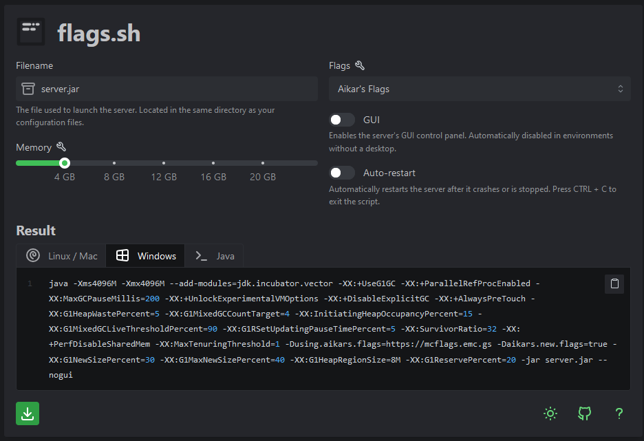

# Windows

Após escolher o [software de servidor](../softwares-de-servidor/) para o seu servidor, baixe ele, e coloque dentro de uma pasta, pode ser na área de trabalho, ou onde preferir, desde que ela esteja vazia e seja facilmente acessível.

Versões diferentes do Minecraft requerem versões específicas do Java, para isso, verifique a versão que o seu servidor precisa [neste guia](../../materiais-recursos/java-classes.md).

Para exemplo deste tutorial, estaremos utilizando [Purpur](https://purpurmc.org/), outros softwares podem ter uma instalação diferente, então verifique antes de seguir.

### Coloque o servidor na pasta

Coloque a .jar do software na pasta do seu servidor, e renomeia para `server.jar` &#x20;

Não consegue ver a extensão do arquivo? (.jar)

Clique em Visualizar, depois Mostrar e seleciona as Exntesões do arquivo, dentro do seu explorador de arquivos

### Crie o arquivo de inicialização

Acesse o website[ flags.sh](https://flags.sh/) e crie o arquivo de inicialização para o seu servidor, tenha certeza que Windows está seleciona, como na print abaixo.

<figure><figcaption></figcaption></figure>

Após isso, clique no botão verde inferior esquerdo para baixar, ele irá lhe dar um start.bat\
Arraste o arquivo até a mesma pasta que está o seu server.jar

### Aceite os termos e condições

Clique duas vezes no `start.bat` , irá abrir um CMD, não se preocupe, após alguns segundos ele irá se fechar, e novas pastas e arquivos serão gerados.

Será criado um eula.txt, acesse ele e modifique o `eula=false` para `eula=true`

eula.txt não foi criado?

Caso o eula.txt não foi criado, significa que houve algum erro na inicialização do servidor, para isso, edite o seu `start.bat` e coloque, no final, em uma nova linha, a palavra `PAUSE` e inicie o servidor novamente.

Assim, o erro que estiver sendo causado estará no cmd aberto, e poderá pesquisar uma resolução, muito provavelmente, o erro será sobre a versão do Java, veja [este guia](../../materiais-recursos/java-classes.md) para a resolução

### Inicie o servidor e se divirta!

Se chegou até este passo, apenas inicie o servidor novamente, apertando duas vezes no `start.bat`, assim, ele estará disponível para você acessar pelo IP `localhost` em sua máquina.

Saberá que o servidor está rodando após aparecer a seguinte mensagem dentro do console que foi aberto:

> Done (16.995s)! For help, type "help"
>
> \*\*\*\*\*\*\*\*\*\*\*\*\*\*\*\*\*\*\*\*\*\*\*\*\*\*\*\*\*\*\*\*\*\*\*\*\*\*\*\*\*\*\*\*\*\*\*\*\*\*\*\*\*\*\*\*\*\*\*\*\*\*\*\*\*\*\*\*\*\*\*\*\*\*\*\*\*\*\*\*\*\*\*\*\*&#x20;
>
> This is the first time you're starting this server.&#x20;
>
> It's recommended you read our 'Getting Started' documentation for guidance.&#x20;
>
> View this and more helpful information here: https://docs.papermc.io/paper/next-steps&#x20;
>
> \*\*\*\*\*\*\*\*\*\*\*\*\*\*\*\*\*\*\*\*\*\*\*\*\*\*\*\*\*\*\*\*\*\*\*\*\*\*\*\*\*\*\*\*\*\*\*\*\*\*\*\*\*\*\*\*\*\*\*\*\*\*\*\*\*\*\*\*\*\*\*\*\*\*\*\*\*\*\*\*\*\*\*\*\*

## Observações

1. O servidor apenas estará acessível para você, em sua máquina, ou em sua rede local (Dentro de seu próprio wifi/internet), e não disponível publicamente.
2. O servidor pode ser acessado por outros via um VPN como Radmin ou Hamachi, desde que seja utilizado o seu IP pelos outros jogadores para acessarem o servidor.
