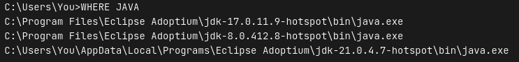

# Classes do Java

Se você já recebeu algum erro em um plugin, já pode ter visto essa mensagem:

> PLUGIN has been compiled by a more recent version of the Java Runtime (class file version 65.0), this version of the Java Runtime only recognizes class file versions up to 62.0

Ou quando você tenta iniciar o servidor pela primeira vez:

> Exception in thread "Server Main" java.lang. Unsupported ClassVersionError: org/bukkit/craftbukkit/Main has been compiled by a more recent version of the Java Runtime (class file version 65.0), this version of the Java Runtime only recognizes class file versions up to 62.0

Este erro ocorre porque a versão do Java instalada no seu sistema não é compatível com a versão da classe do plugin. Veja a tabela:

| **Java** | **Class Major Version** |
| :------: | :---------------------: |
|    22    |            66           |
|    21    |            65           |
|    20    |            64           |
|    19    |            63           |
|    18    |            62           |
|    17    |            61           |
|    16    |            60           |
|    15    |            59           |
|    14    |            58           |
|    13    |            57           |
|    12    |            56           |
|    11    |            55           |
|    10    |            54           |
|     9    |            53           |
|     8    |            52           |
|     7    |            51           |
|     6    |            50           |
|     5    |            49           |
|    1.4   |            48           |
|    1.3   |            47           |
|    1.2   |            46           |
|    1.1   |            45           |
|   1.0.2  |            45           |

### Para resolver este problema, siga as etapas:

1. Identifique a versão do plugin: A versão da classe mencionada no erro. No primeiro exemplo acima, é a versão 65.0.
2. Encontre a versão correspondente na tabela acima. Para o exemplo, a versão 65.0 corresponde ao Java 21.
3. Atualize e instale a versão do Java que corresponde à versão do arquivo de classe. Você pode baixar o Java pelo [Adoptium.net](https://adoptium.net).

### Caso esteja em seu computador

Caso após atualizar o java e iniciar o servidor novamente o problema não se resolveu, e você está iniciando em seu computador, é necessário editar o seu script de inicialização, como coberto[ neste tutorial](../iniciando-um-servidor/em-casa/).

1. Abra um prompt de comando (cmd) e digite o seguinte comando: `WHERE JAVA`

Irá receber a seguinte resposta, ou similar:

<figure><figcaption></figcaption></figure>

Veja qual dos Javas indicado é para a sua versão do servidor, na print a cima, respectivamente, cada localização do java corresponde, respectivamente, as versões 17, 8 e 21.

2. Edite o seu start.bat para conter a localização do Java.

Dentro do seu start.bat, a primeira palavra será `java`, remova ela e coloque a localização do Java no qual precisa utilizar, como no exemplo abaixo:

**Troque:** `java -Xms4096M -Xmx4096M ...`

**Para:** `"C:\Users\You\AppData\Local\Programs\Eclipse Adoptium\jdk-21.0.4.7-hotspot\bin\java.exe" -Xms4096M -Xmx4096M ...`

<mark style="color:red;">Não copie cegamente o exemplo a cima, utilize a localização no qual o comando WHERE JAVA lhe deu.</mark>

3. Inicie o seu servidor novamente e veja se o problema foi corrigido.
