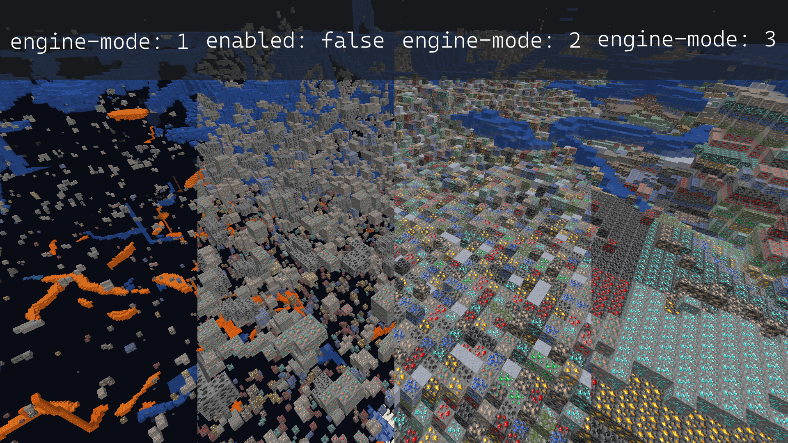
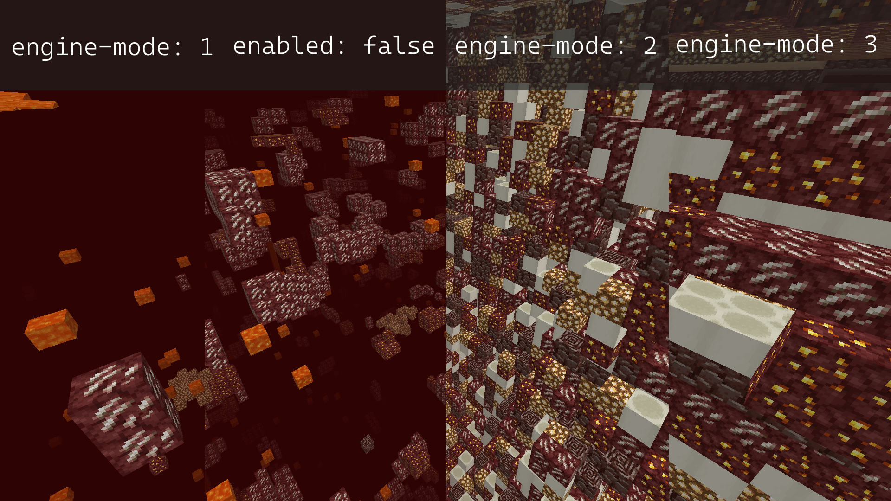

# Anti X-Ray

Este guia é apenas uma tradução do guia original do paper acessível [neste link](https://docs.papermc.io/paper/anti-xray).

#### Arquivo: [paper-world configuration](https://docs.papermc.io/paper/reference/world-configuration)

**Configuração: anti-xray.enabled**

`Bom valor inicial: true`

Habilite isso para esconder minérios de players que usam X-ray. Habilitar isso realmente diminuirá o desempenho, no entanto, é muito mais eficiente do que qualquer plugin anti-xray. Na maioria dos casos, o impacto no desempenho será insignificante.

**Configuração: engine-mode**

Anti-Xray tem dois modos diferentes. <mark style="color:yellow;">`engine-mode: 1`</mark> substitui os blocos especificados (<mark style="color:yellow;">`hidden-blocks`</mark>) por outros blocos "falsos", `stone` (`deepslate` em y < 0), `netherrack` ou `end_stone` com base na dimensão. Em contraste, o <mark style="color:yellow;">`engine-mode: 2`</mark> substituirá os <mark style="color:yellow;">`hidden-blocks`</mark> e os <mark style="color:yellow;">`replacement-blocks`</mark> por <mark style="color:yellow;">`hidden-blocks`</mark> gerados aleatoriamente. <mark style="color:yellow;">`engine-mode: 3`</mark> funciona de forma similar ao <mark style="color:yellow;">`egine-mode: 2`</mark>, porém, ao invés de randomizar todos os blocos, ele randomizas o blocos para cada camada da chunk.\
\
As imagens a seguir mostram como cada modo ficará para um jogador usando Xray com a configuração recomendada tanto no overworld quanto no nether.

<figure><figcaption></figcaption></figure>

<figure><figcaption></figcaption></figure>

Especialmente no lado do cliente, o <mark style="color:yellow;">`engine-mode: 1`</mark> é muito menos intensivo computacionalmente, enquanto o <mark style="color:yellow;">`engine-mode: 2`</mark> pode impedir melhor o Xray. Com o <mark style="color:yellow;">`engine-mode: 1`</mark>, apenas os minérios totalmente cobertos por blocos sólidos ficarão ocultos. Minérios expostos ao ar em cavernas ou água de um lago não serão escondidos. Com o <mark style="color:yellow;">`engine-mode: 1`</mark>, minérios falsos obstruem a visão de blocos reais. Se <mark style="color:yellow;">`air`</mark> for adicionado aos <mark style="color:yellow;">`hidden-blocks`</mark>, o <mark style="color:yellow;">`engine-mode: 2`</mark> ocultará efetivamente todos os minérios, mesmo aqueles expostos ao ar. <mark style="color:yellow;">`engine-mode: 3`</mark> pode reduzer o peso sobre a rede quando entrando por um fator de \~2 e ajuda com a compressão do pacote da chunk.

**BYPASS ANTI-XRAY**

**Extensão de alcance:** Embora o Anti-Xray sozinho impeça a maioria dos usuários de fazer raios-X em seu servidor, ele não é de forma alguma infalível. Por causa de como o Anti-Xray é (e tem que ser) implementado, é possível, em um servidor padrão, estender a gama de minérios reais que você pode ver em uma quantidade não insignificante. Isso pode ser mitigado por qualquer plug-in anti-fraude competente; no entanto, isso não está incluído fora da caixa.

**Reversão de sementes/seed:** Outro vetor de ataque é a natureza determinística da geração mundial do Minecraft. Se o cliente conseguir obter a seed do mundo, ele poderá saber a localização real de cada minério gerado, ignorando completamente o Anti-Xray. Isso pode ser parcialmente contornado tornando mais difícil para o cliente reverter a semente do mundo com a configuração de [`feature-seeds`](https://docs.papermc.io/paper/reference/world-configuration#feature-seeds), em conjunto com as opções de semente de estrutura em `spigot.yml`. Observe que esta não é uma solução completa e ainda pode ser possível para um cliente obter a semente mundial do servidor. Usar uma semente diferente para cada mundo também pode ser benéfico.

**Minérios expostos ao ar:** Tanto no <mark style="color:yellow;">`engine-mode: 1`</mark>, <mark style="color:yellow;">`engine-mode: 2`</mark> e <mark style="color:yellow;">`engine-mode: 3`</mark>, é possível para um cliente visualizar minérios expostos ao ar. Isso pode ser atenuado no <mark style="color:yellow;">`engine-mode: 2`</mark> e <mark style="color:yellow;">`engine-mode: 3`</mark> adicionando <mark style="color:yellow;">`air`</mark> à lista de <mark style="color:yellow;">`hidden-blocks`</mark>. No entanto, fazer isso pode causar problemas de desempenho do cliente (quedas de FPS) para alguns jogadores.

#### **ESPAÇAMENTO**

YAML se preocupa com espaços em branco! O exemplo de configuração abaixo já está formatado corretamente. Certifique-se de que a formatação e a indentação permaneçam inalterados usando o botão “copiar” no canto superior direito de cada exemplo. Certifique-se especialmente de que nenhum tabulador seja inserido acidentalmente. Verifique as opções do seu editor para usar espaços em vez de tabulações para identação. Caso o seu arquivo de configuração já contenha outras alterações importantes, é recomendável fazer um backup antes de editá-lo.

#### **Configuração recomendada para cada tipo:**


[configuracao-engine-mode-1.md](configuracao-engine-mode-1.md)



[configuracao-engine-mode-2.md](configuracao-engine-mode-2.md)



[configuracao-engine-mode-2-1.md](configuracao-engine-mode-2-1.md)


### FAQ - problemas comuns e suporte

Ainda posso ver (alguns) minérios / usar raio-X

Conforme descrito acima, há vários motivos pelos quais você ainda pode ver (alguns) minérios mesmo depois de ter ativado o Anti-Xray:

* Os minérios estão acima do valor configurado de altura máxima (`max-block-height`).&#x20;
* O Anti-Xray não pode esconder minérios expostos ao ar ou outros blocos transparentes (em cavernas, por exemplo). Em princípio, este também é o caso do <mark style="color:yellow;">`engine-mode: 2`</mark> e do<mark style="color:yellow;">`engine-mode: 3`</mark>, no entanto, geralmente os minérios falsos obstruem a visão dos blocos reais. Ocultar esses minérios expostos também requer plug-ins adicionais.&#x20;
* A opção `use-permission` está habilitada e você tem a permissão de byppas do Anti-Xray (`paper.antixray.bypass`) ou tem status de operador.&#x20;
* O tipo de bloco está faltando nas listas de bloqueio configuradas. Isso pode ser o resultado do uso de um arquivo de configuração desatualizado.

Adicionei blocos falsos, mas o raio X não os mostra

Se você usa <mark style="color:yellow;">`engine-mode: 2`</mark> ou <mark style="color:yellow;">`engine-mode: 3`</mark> e adicionou blocos falsos à lista de blocos ocultos, mas não consegue vê-los no jogo usando o raio-X, isso pode ter os seguintes motivos:

* Os tipos de bloco adicionados são[ tile entities](https://minecraft.fandom.com/wiki/Block\_entity). O Anti-Xray pode ocultar (substituir) [tile entities](https://minecraft.fandom.com/wiki/Block\_entity) (como baús), desde que não sejam expostas ao ar ou a outros blocos transparentes. No entanto, o Anti-Xray não pode usar [tile entities](https://minecraft.fandom.com/wiki/Block\_entity) como blocos falsos no bloco.&#x20;
* O bloco está desabilitado no mod X-ray do seu cliente ou não é mostrado pelo seu pacote de recursos X-ray.

Não funciona abaixo de y = 0 ou em alguns outros lugares.

* Seu arquivo de configuração provavelmente está desatualizado e faltam blocos importantes na lista de blocos de substituição, como `deepslate` ou blocos específicos de bioma, como `basalt`. Você também pode querer verificar se a lista de blocos ocultos (`hidden-blocks`) inclui todos os minérios importantes e suas variantes de deepslate.&#x20;
* Se não funcionar acima de um determinado nível y, verifique sua configuração de altura máxima do bloco (`max-block-heigh`).

Ainda não funciona, solução de problemas adicionais

* Certifique-se de sempre reiniciar o servidor após fazer alterações na configuração do Anti-Xray. As alterações não serão aplicadas automaticamente.&#x20;
* **Não** use o comando `/reload`. Para aplicar alterações na configuração do Anti-Xray, é necessário reiniciar.&#x20;
* Após reiniciar o servidor, verifique se a configuração foi aplicada corretamente inspecionando as seções de configuração com timings ou spark.

