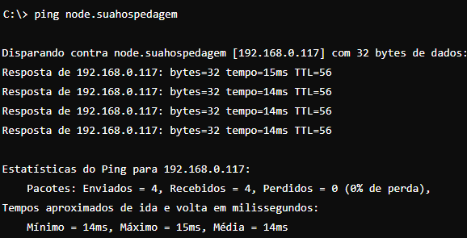

# Pelo prompt de comando

Para obter o endereço IP de um domínio usando o prompt de comando no Windows, siga estes passos:

1. Pressione Win + R para abrir o diálogo Executar.
2. Digite cmd e pressione Enter para abrir o Prompt de Comando.
3. No Prompt de Comando, digite o seguinte comando abaixo e pressione Enter

<figure></figure>

O comando ping verifica a conexão com um endereço IP, mas não usa portas (:25566). Ele só testa se o servidor está acessível, sem considerar serviços específicos na rede.
